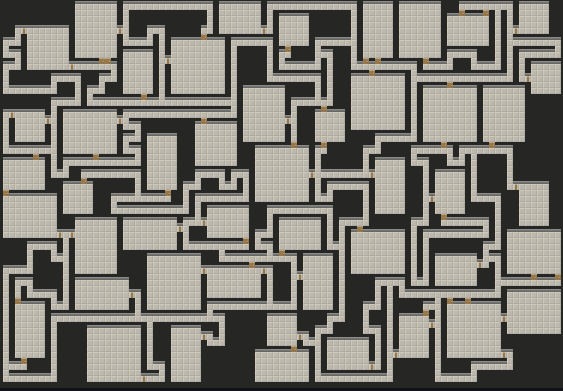
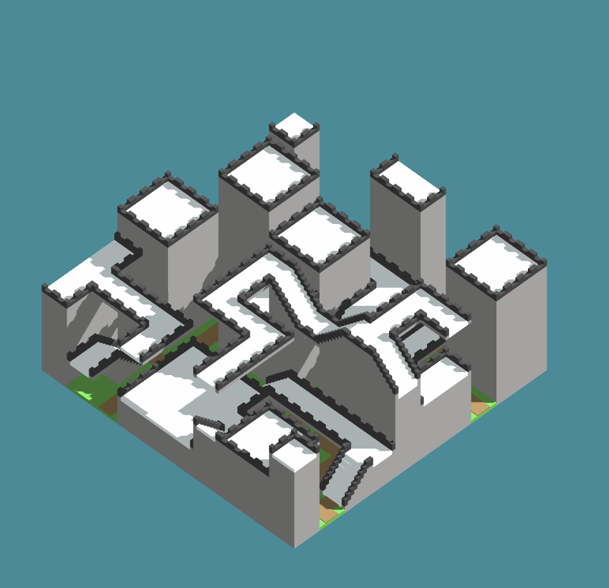
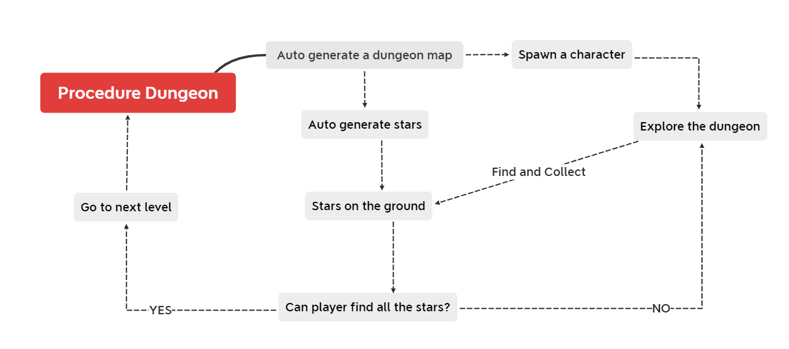
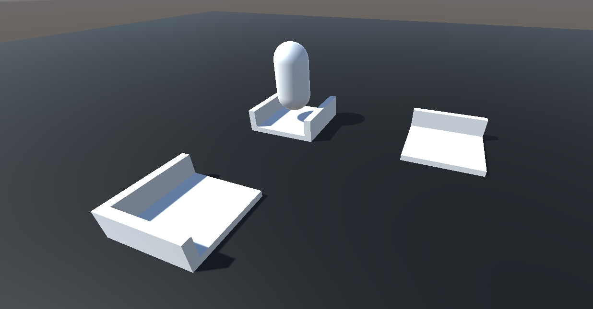
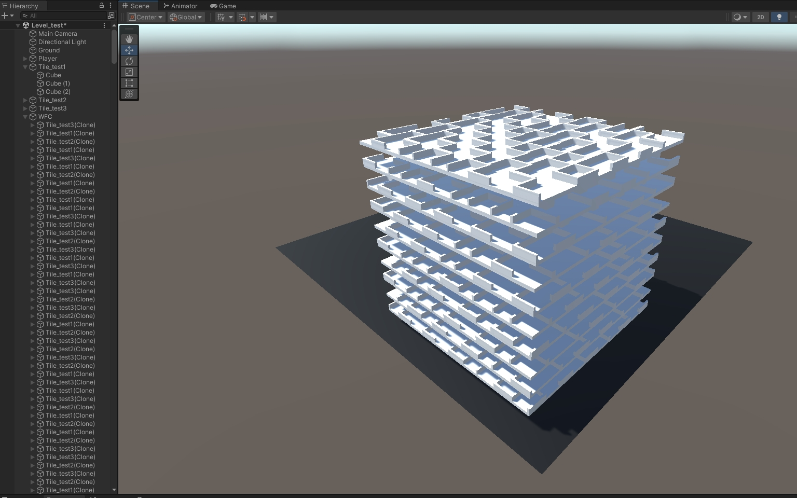

# Final Project - Feel the 3D Dungeon!

This is it! The culmination of your procedural graphics experience this semester. For your final project, we'd like to give you the time and space to explore a topic of your choosing. You may choose any topic you please, so long as you vet the topic and scope with an instructor or TA. We've provided some suggestions below. The scope of your project should be roughly 1.5 homework assignments). To help structure your time, we're breaking down the project into 4 milestones:

## Project planning: Design Doc (due 11/6)

# Design Doc

## Introduction
#### What motivates your project?

With the CGGT SIGLAB has been moved to a "Dungeon", and as a gameplay engineer, after taking the procedure generation course, I was thinking: what if I build a procedure dungeon game level in Unity3D? Therefore, I want to create an infinite-level puzzle game. The gameplay should be very easy to understand and get started. Once the player starts the game, it will automatically generate a character in a random starting place, player needs to find all the stars that randomly dropped in the dungeon. If the player can collect all the stars on the current level, the system will move the player to the next level, the entire dungeon map will be shuffled and the player needs to collect all the stars again to get into the next level. As the level increases, the player needs to collect more and more stars (maximum 5 stars).

|Dungeon Map|
|:-:|
||

## Goal
#### What do you intend to achieve with this project?

I want to create a high-freedom 3D puzzle game with the implementation of Wave Function Collapse [Algorithm reference](https://github.com/mxgmn/WaveFunctionCollapse)

## Inspiration:
- You must have some form of reference material for your final project. Your reference may be a research paper, a blog post, some artwork, a video, another class at Penn, etc.  
- Include in your design doc links to and images of your reference material.

In the beginning, I was inspired by this project: [3D Wavefunction Collapse Dungeon Generator](https://whaoran0718.github.io/3dDungeonGeneration/)

|Dungeon Generator|
|:-:|
||

The most important part of the implementation is the Wave Function Collapse algorithm, I found this: [Algorithm reference](https://github.com/mxgmn/WaveFunctionCollapse) as a reference.

## Specification:
#### Outline the main features of your project.
##### 1. 3D Character Movement
##### 2. Procedure Dungeon Generator
##### 3. Random Stars Generator

## Techniques:
#### What are the main technical/algorithmic tools you’ll be using? Give an overview, citing specific papers/articles.
[Wave Function Collapse Algorithm reference](https://github.com/mxgmn/WaveFunctionCollapse)
[Procedural Generation with Wave Function Collapse](https://www.gridbugs.org/wave-function-collapse/)

## Design:
#### How will your program fit together? Make a simple free-body diagram illustrating the pieces.

## Timeline:
#### Create a week-by-week set of milestones for each person in your group. Make sure you explicitly outline what each group member's duties will be.

|            | MileStone 1                                                                     | MileStone 2                                                                      | MileStone 3 |
|  ----      | ----                                                                            | ----                                                                             | ----  |
| Akiko Zhu  | Setup develop environment                                          | Finish the tile map generator, make WFC algorithm working in 3D scene            | Polish the procedural generation        | 
|            | Complete 3D character basic movement                               | Finish the random stars generator                                                | Fix all the bugs                        |
|            | Implement basic data structure of wave function collapse algorithm | Complete tiles model, Create basic materials, Finish the level generator                               | Polish the materials                    |

## Milestone 1: Implementation part 1 (DONE: due 11/13)
#### 1. Set up everything for the game development
#### 2. Implement C# script to achieve 3D character movement, including vertical and horizontal movement, and jump
#### 3. Implement a spherical camera such that the camera will always look at the character and rotate by the cursor

|Character & Camera Controller|
|:-:|
||

#### 4. Create some basic tiles for the wave function collapse algorithm, and implement the algorithm framework

|Basic tiles|
|:-:|
||

## Milestone 2: Implementation part 2 (DONE: 11/25)

#### 1. Finish the tile map generator, make the WFC algorithm work in 3D scene

|3D WFC algorithm|
|:-:|
||

|A 10x10x10 Grid WFC|
|:-:|
||

#### 2. Implement C# script to achieve random star generation
#### 3. Complete all the tiles model, Finish the infinite-level generation function

|New tiles|
|:-:|
||

|Gameplay Demo|
|:-:|
||

## Milestone 3: Implementation part 3 (DONE)
#### Optimization and suggestions from the class
- Add lose condition
- Camera that can switch btw. 1st and 3rd persp.
- Add boundary of the dungeon

#### 1. Working on the shaders, UI, materials, lights, and atmosphere. Make the entire game scene more artistic and creative.
#### 2. Make sure the entire game has no bugs at all.
#### 3. Clean up the unnecessary codes, such as debug logs and test functions.

|Final DEMO|
|:-:|
||

## Final submission (due 12/2)
Time to polish! Spen this last week of your project using your generator to produce beautiful output. Add textures, tune parameters, play with colors, play with camera animation. Take the feedback from class critques and use it to take your project to the next level.

Submission:
- Push all your code / files to your repository
- Come to class ready to present your finished project
- Update your README with two sections 
  - final results with images and a live demo if possible
  - post mortem: how did your project go overall? Did you accomplish your goals? Did you have to pivot?

